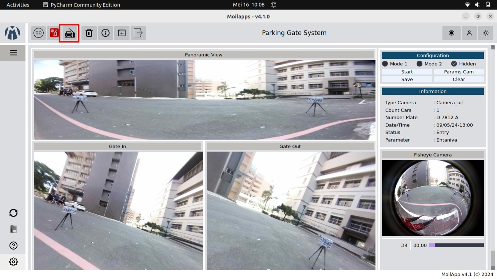

# moilapp-plugin-car-parking-systems
*Last Update: May 9, 2024*

### *Create by*

* Abdul Aziz
* I Made Adhika Dananjaya 
* Rega Arzula Akbar 

### Introduction

Moilapp plugin car parking system is a plugin designed as an example for creating new Moilapp plugins. This plugin was created with the aim of making it easier for an institution to monitor vehicles entering or leaving a place in the parking area. This plugin will record the vehicle license plate, the time the vehicle enters or leaves the parking area, and the number of cars entering or leaving the parking area.


### Requirements
```
moildev==4.0.0
PyQt6==6.4.2
PyYAML==5.4.1
```

### How to Run | Usage
To use this plugin, follow these steps :
1. Open the Moilapp directory in the terminal.
2. Build the virtual environment:
```
$ virtualenv venv
```
3. Activated the virtual environment:
```
$ source venv/bin/activate
```
4. Navigate to the plugin directory:
```
$ cd src/plugins
```
5. Clone the repository :
```
$ git clone https://github.com/Herusyahputra/moilapp-plugin-car-parking-systems.git
```
5. Navigate to car parking plugin:
```
$ cd moilapp-plugin-car-parking-systems
```
8. Install requirement:
```
$ pip install -r requirements.txt
```
9. Back to the *src* directory:
```
$ cd ../../
```
10. Run the Moilapp:
```
$ python3 main.py
```
11. select the plugin that has been marked


### Contact
For any questions, suggestions, or concerns regarding the Plugin Application, please feel free to contact the repository owner at herusyahputra@telkomuniversity.ac.id. 
